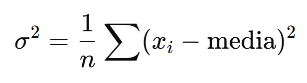
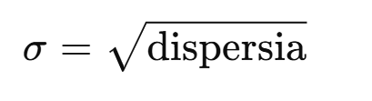

# 1 Statistici

La un chestionat anonim elevii au dat note intre 1 si 10 (numere intregi) pentru modalitatea de predare a unui profesor. Datele colectate sunt urmatoarele:
| Nota | Număr elevi |
|------|-------------|
|  1   |      3      |
|  2   |      2      |
|  3   |      4      |
|  4   |      5      |
|  5   |      8      |
|  6   |      12     |
|  7   |      15     |
|  8   |      20     |
|  9   |      18     |
| 10   |      13     |

Vrem sa calculam cateva statistici descriptive pentru aceste date.

a) Media aritmetica
b) Mediana
c) Modul
d) Dispersia
e) Abaterea standard
f) Minimul si maximul
g) Quartilele Q1 si Q3

Scrie un program care sa calculeze aceste statistici pe baza datelor oferite.

```java

import java.util.Arrays;

public class StatisticsApp {

    public static void main(String[] args) {

        // freq[1] = 3 elevi au dat nota 1
        int[] freq = {0, 3, 2, 4, 5, 8, 12, 15, 20, 18, 13};

        int[] data = expandFrequencies(freq);

        System.out.println("Media: " + mean(data));
        System.out.println("Mediana: " + median(data));
        System.out.println("Modul: " + mode(freq));
        System.out.println("Dispersia: " + variance(data));
        System.out.println("Abaterea standard: " + stdDev(data));
        System.out.println("Minimul: " + min(data));
        System.out.println("Maximul: " + max(data));
        System.out.println("Q1: " + quartileQ1(data));
        System.out.println("Q3: " + quartileQ3(data));
    }


    // ================================
    // 1. Atribuire frecvențe în array
    // ================================
    public static int[] expandFrequencies(int[] freq) {
        // TODO: calculează lungimea totală
        // TODO: crează array-ul final
        // TODO: adaugă nota i de freq[i] ori în array
        return null;
    }


    // ================================
    // 2. Media aritmetica
    // ================================
    public static double mean(int[] arr) {
        // TODO: sumă / număr elemente
        return 0;
    }


    // ================================
    // 3. Mediana
    // ================================
    public static double median(int[] arr) {
        // TODO:
        // 1. fă o copie
        // 2. sorteaz-o
        // 3. dacă n impar → mijloc
        //    dacă par → media celor două din mijloc
        return 0;
    }


    // ================================
    // 4. Modul (pe baza frecvențelor)
    // ================================
    public static int mode(int[] freq) {
        // TODO: găsește indicele cu frecvența maximă
        return 0;
    }


    // ================================
    // 5. Dispersia
    // Var = sum((xi - mean)^2) / n
    // ================================
    public static double variance(int[] arr) {
        // TODO: calculează media
        // TODO: calculează suma pătratelor abaterilor
        return 0;
    }


    // ================================
    // 6. Abaterea standard
    // ================================
    public static double stdDev(int[] arr) {
        // TODO: sqrt din dispersie
        return 0;
    }


    // ================================
    // 7. Minim și maxim
    // ================================
    public static int min(int[] arr) {
        // TODO
        return 0;
    }

    public static int max(int[] arr) {
        // TODO
        return 0;
    }


    // ================================
    // 8. Quartile Q1 și Q3
    // ================================
    public static double quartileQ1(int[] arr) {
        // TODO:
        // 1. sortează array-ul
        // 2. ia jumătatea inferioară
        // 3. returnează mediana acelei jumătăți
        return 0;
    }

    public static double quartileQ3(int[] arr) {
        // TODO:
        // 1. sortează array-ul
        // 2. ia jumătatea superioară
        // 3. returnează mediana acelei jumătăți
        return 0;
    }
}
```

Explicatii:
- media aritmetica reprezinta media datasetului

- mediana reprezinta valoarea din mijloc a datasetului **sortat** (daca numarul de elemente este par, se face media celor doua valori din mijloc, iar daca este impar, se ia valoarea din mijloc)
- modul reprezinta valoarea care apare cel mai des in dataset
- dispersia reprezinta masura variabilitatii datelor fata de media acestora

Daca dispersia este mica, valorile sunt apropiate de medie, iar daca este mare, valorile sunt mai raspandite.
- abaterea standard reprezinta radacina patrata a dispersiei

- minimul si maximul reprezinta valorile cele mai mici si cele mai mari din dataset
- quartilele Q1 si Q3 reprezinta valorile care impart datasetul in patru parti egale. Q1 este mediana primei jumatati a datasetului, iar Q3 este mediana celei de-a doua jumatati a datasetului.
